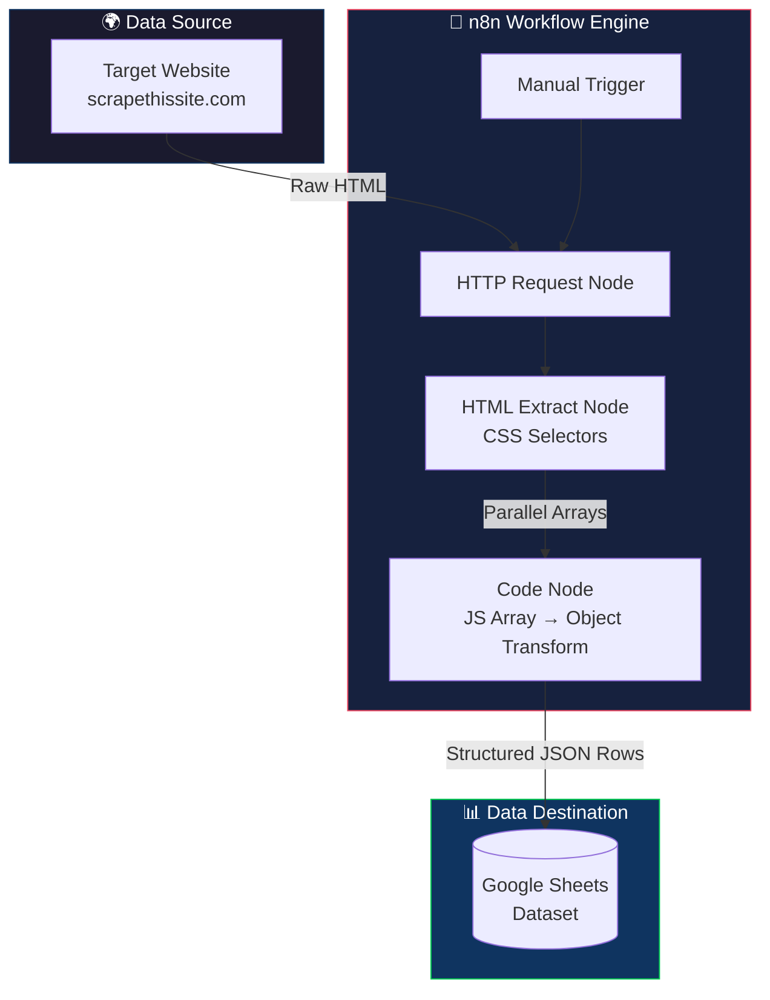

<div align="center">

# 🕷️ Auto Scraper

### An Automated Web Scraping → ETL → Google Sheets Pipeline, Built with n8n

[](https://n8n.io)
[](#)
[](#)
[](#license)
[](#)
[](#)

**Turn any website into a structured, auto-updating spreadsheet dataset — with zero backend code.**

</div>

<p align="center">
  
</p>


## 📑 Table of Contents

- [Overview](#-overview)
- [Features](#-features)
- [Workflow](#-workflow)
- [Workflow Diagram](#-workflow-diagram)
- [Architecture Diagram](#-architecture-diagram)
- [Screenshots](#-screenshots)
- [Dataset](#-dataset)
- [Installation](#-installation)
- [Usage](#-usage)
- [Customization](#-customization)
- [Example Output](#-example-output)
- [Project Structure](#-project-structure)
- [Skills Demonstrated](#-skills-demonstrated)
- [Future Improvements](#-future-improvements)
- [FAQ](#-faq)
- [Troubleshooting](#-troubleshooting)
- [License](#-license)
- [Author](#-author)


## 🧭 Overview

**Auto Scraper** is a fully automated web scraping and ETL (Extract → Transform → Load) pipeline built entirely inside **n8n** — no backend server, no custom API, no manual copy-pasting.

With a single click, the workflow:

1. **Fetches** raw HTML from a target website.
2. **Extracts** structured fields using CSS selectors.
3. **Transforms** the extracted arrays into clean, row-based JSON objects via JavaScript.
4. **Loads** the final dataset directly into a **Google Sheet**, updating existing rows and appending new ones automatically.

> [!TIP]
> This project is a practical demonstration of building **production-style ETL pipelines** using low-code tooling — ideal for dataset generation, market research, price monitoring, or lead scraping use cases.

By default, the workflow scrapes [**scrapethissite.com — Countries of the World**](https://www.scrapethissite.com/pages/simple/), but it is designed to be **easily repointed at any website** with minimal configuration changes.


## ✨ Features

| Icon | Feature | Description |
|:---:|---|---|
| ⚡ | **One-Click Execution** | Trigger the entire pipeline manually with a single click. |
| 🌐 | **HTTP-Based Scraping** | Fetches raw HTML from any public webpage. |
| 🎯 | **CSS Selector Extraction** | Precisely targets data fields using selectors. |
| 🧹 | **Automatic Text Cleanup** | Strips whitespace and normalizes extracted text. |
| 🔄 | **JS-Based Transformation** | Converts parallel arrays into structured JSON row objects. |
| 📊 | **Google Sheets Sync** | Appends new rows and updates existing ones (`appendOrUpdate`). |
| 🧩 | **No Backend Required** | 100% no-code/low-code — runs entirely inside n8n. |
| 🔁 | **Reusable Template** | Swap URL + selectors to scrape any structured website. |
| 🧪 | **ETL Demonstration** | Clean example of Extract → Transform → Load architecture. |


## ⚙️ Workflow

The pipeline consists of **5 core nodes**, executed sequentially:

### 1️⃣ Manual Trigger
> **Node:** `When clicking 'Execute workflow'`

The entry point of the workflow. Starts execution on demand when the user clicks **"Execute Workflow"** inside the n8n editor. This can later be swapped for a **Schedule Trigger** or **Webhook Trigger** for full automation.

### 2️⃣ HTTP Request
> **Node:** `HTTP Request`

Sends a `GET` request to the target website:

```
https://www.scrapethissite.com/pages/simple/
```

Returns the full raw HTML document of the page, which is passed downstream for parsing.

### 3️⃣ HTML Extract
> **Node:** `HTML`

Parses the raw HTML using the `extractHtmlContent` operation and pulls out structured fields using **CSS selectors**, with `returnArray: true` so each field becomes an array of matches across the page:

| Field | CSS Selector |
|---|---|
| Country Name | `.country-name` |
| Country Population | `.country-population` |
| Country Area | `.country-area` |
| Country Capital | `.country-capital` |

Text cleanup (`cleanUpText: true`) is enabled to strip extra whitespace and line breaks.

### 4️⃣ JavaScript Transformation
> **Node:** `Code`

The HTML node returns **4 parallel arrays** (one per field). This Code node loops through them and converts them into an **array of clean row objects** — one object per country — ready for spreadsheet insertion:

```javascript
const items = [];
const inputData = $input.first().json;
const countryNames = inputData["Country Name"] || [];
const populations = inputData["Country population "] || [];
const areas = inputData["Country area"] || [];
const capitals = inputData['Country capitll '] || [];

const maxLength = Math.max(countryNames.length, populations.length, areas.length, capitals.length);

for (let i = 0; i < maxLength; i++) {
  items.push({
    "Country Name": countryNames[i] || "",
    "Country Population": populations[i] || "",
    "Country Area": areas[i] || "",
    "Country capital": capitals[i] || ""
  });
}
return items;
```

> [!NOTE]
> This step is the **"Transform"** stage of the ETL pipeline — converting raw parallel arrays into row-aligned, spreadsheet-ready records.

### 5️⃣ Google Sheets
> **Node:** `Google Sheets`

Writes the transformed dataset into a target Google Sheet using the **`appendOrUpdate`** operation:

- Matches existing rows using **Country Name** as the key column.
- Appends new countries as new rows.
- Updates existing countries if data changes.
- Authenticated via **Google Sheets OAuth2** credentials.


## 🔀 Workflow Diagram


## 🏗️ Architecture Diagram




## 🖼️ Screenshots

> [!NOTE]
> Replace the placeholders below with actual screenshots of your workflow and output sheet.

| Workflow Canvas | Google Sheets Output |
|---|---|
| `` | `` |

| Execution Success | HTML Extraction Result |
|---|---|
| `` | `` |


## 🗂️ Dataset

The final dataset produced by this workflow contains **4 columns**, one row per scraped country:

| Column | Type | Description |
|---|---|---|
| `Country Name` | `string` | Full name of the country |
| `Country Population` | `string / number` | Total population as listed on the source site |
| `Country Area` | `string / number` | Land area in km² |
| `Country Capital` | `string` | Capital city of the country |

> [!IMPORTANT]
> `Country Name` is used as the **matching key** for the `appendOrUpdate` operation in Google Sheets — ensuring no duplicate rows are created on repeated runs.


## 🛠️ Installation

### Prerequisites

- A running instance of [n8n](https://n8n.io) (Cloud, Desktop, or self-hosted)
- A Google account with access to Google Sheets
- A Google Sheets OAuth2 credential configured in n8n

### Steps

1. **Download** the workflow file: [`Auto_Scraper.json`](./Auto_Scraper.json)
2. Open your **n8n editor**.
3. Click **Workflows → Import from File** (or use `⋮` menu → **Import from File**).
4. Select `Auto_Scraper.json`.
5. Open the **Google Sheets** node and select/create your **Google Sheets OAuth2 credential**.
6. Point the `documentId` and `sheetName` fields to your own target spreadsheet.
7. Save the workflow.


## ▶️ Usage

1. Open the imported **Auto Scraper** workflow in n8n.
2. Click **Execute Workflow** (▶️) in the top-right corner.
3. The workflow will:
   - Fetch the target webpage.
   - Extract structured fields via CSS selectors.
   - Transform the data into clean JSON rows.
   - Write/update the rows in your connected Google Sheet.
4. Open your **Google Sheet** to view the freshly scraped dataset.

> [!TIP]
> For recurring scraping, replace the **Manual Trigger** with a **Schedule Trigger** node to run this pipeline daily, hourly, or on any custom cron schedule.


## 🎛️ Customization

This template is designed to be **easily adapted** to scrape different websites and datasets.

### 🌐 Change the Website URL
Open the **HTTP Request** node and update the `url` field:

```text
https://your-target-website.com/page
```

### 🎯 Change the CSS Selectors
Open the **HTML** node and update the `extractionValues` to match the target site's DOM structure:

```text
.your-css-class-name
```

Add, remove, or rename fields as needed — just make sure the **Code** node references match the updated keys.

### 📊 Change the Output Spreadsheet
Open the **Google Sheets** node and update:

- `documentId` → your target Google Sheet's ID
- `sheetName` → your target sheet/tab name
- `matchingColumns` → the column used to prevent duplicate rows

### 🎯 Change the Destination Entirely
Swap the **Google Sheets** node for:

- **Airtable** for a database-style destination
- **Notion** for a knowledge-base style destination
- **Postgres/MySQL** for a relational database destination
- **CSV / Write Binary File** for local file export


## 📋 Example Output

Below is a **sample** of what the final Google Sheet dataset looks like:

| Country Name | Country Population | Country Area (km²) | Country Capital |
|---|---|---|---|
| Andorra | 84,000 | 468.0 | Andorra la Vella |
| United Arab Emirates | 4,975,593 | 82,880.0 | Abu Dhabi |
| Afghanistan | 29,121,286 | 647,500.0 | Kabul |
| Antigua and Barbuda | 86,754 | 443.0 | St. John's |
| Anguilla | 13,254 | 102.0 | The Valley |


## 📁 Project Structure

```
auto-scraper/
│
├── Auto_Scraper.json          # n8n workflow export (import this into n8n)
├── README.md                  # Project documentation (this file)
│
├── screenshots/                # Optional: workflow & output screenshots
│   ├── workflow-canvas.png
│   ├── google-sheet-output.png
│   ├── execution-success.png
│   └── html-extraction.png
│
└── LICENSE                     # MIT License
```


## 🧠 Skills Demonstrated

| Skill | Applied In |
|---|---|
| 🕸️ **Web Scraping** | HTTP Request + HTML Extract nodes |
| 🤖 **Automation** | End-to-end n8n workflow orchestration |
| 🔁 **ETL (Extract → Transform → Load)** | Full pipeline design |
| 🧹 **Data Cleaning** | `cleanUpText` + JS normalization |
| 🧑‍💻 **JavaScript** | Custom Code node for array-to-object transformation |
| 📊 **Google Sheets Integration** | OAuth2 auth + `appendOrUpdate` logic |
| 🧩 **No-Code / Low-Code Automation** | Entire pipeline built visually in n8n |


## 🚀 Future Improvements

- [ ] 📄 **Pagination support** — scrape multi-page websites automatically
- [ ] ⏰ **Scheduled scraping** — replace Manual Trigger with Cron/Schedule Trigger
- [ ] 🛡️ **Proxy support** — rotate proxies to avoid rate-limiting/blocking
- [ ] 🔁 **Retry mechanism** — automatic retries on failed HTTP requests
- [ ] 📤 **CSV export** — optional local CSV output alongside Google Sheets
- [ ] 🗄️ **Database support** — write to Postgres/MySQL/MongoDB
- [ ] 📧 **Email notifications** — alert on success/failure via Gmail/SMTP node


## ❓ FAQ

<details>
<summary><strong>Does this require any coding knowledge?</strong></summary>
<br>
Minimal. The only code involved is a small JavaScript snippet inside the Code node, which is pre-written and reusable. Everything else is configured visually in n8n.
</details>

<details>
<summary><strong>Can I scrape a different website with this template?</strong></summary>
<br>
Yes. Update the URL in the HTTP Request node and the CSS selectors in the HTML node to match your target site's structure.
</details>

<details>
<summary><strong>Does it support JavaScript-rendered (SPA) websites?</strong></summary>
<br>
Not out of the box — the HTTP Request node fetches static HTML only. For JS-heavy sites, consider adding a headless browser node (e.g., Puppeteer/Playwright via a custom node or the n8n Browserless integration).
</details>

<details>
<summary><strong>Will re-running the workflow create duplicate rows?</strong></summary>
<br>
No. The Google Sheets node uses <code>appendOrUpdate</code> with <code>Country Name</code> as the matching column, so existing rows are updated instead of duplicated.
</details>


## 🧯 Troubleshooting

| Issue | Possible Cause | Solution |
|---|---|---|
| ❌ HTTP Request fails | Website blocks bots / requires headers | Add a `User-Agent` header in the HTTP Request node's options |
| ⚠️ Empty extraction results | CSS selectors don't match site structure | Inspect the target page's HTML and update selectors |
| 🔀 Mismatched columns in Sheet | Field name typos between HTML & Code nodes | Ensure key names match exactly (case-sensitive, including spaces) |
| 🔑 Google Sheets auth error | Expired/invalid OAuth2 credential | Reconnect the Google Sheets OAuth2 credential in n8n |
| 🐢 Workflow runs but Sheet doesn't update | Wrong `documentId` or `sheetName` | Verify the Sheet ID and tab name in the Google Sheets node |


## 📄 License

This project is licensed under the **MIT License** — free to use, modify, and distribute.

```
MIT License

Copyright (c) 2026

Permission is hereby granted, free of charge, to any person obtaining a copy
of this software and associated documentation files, to deal in the Software
without restriction, including without limitation the rights to use, copy,
modify, merge, publish, distribute, sublicense, and/or sell copies of the
Software, subject to the following conditions...
```

See [`LICENSE`](./LICENSE) for full details.


## 👤 Author

<div align="center">

**Your Name Here**

[](https://github.com/your-username)
[](https://linkedin.com/in/your-profile)
[](https://your-portfolio.com)
[](mailto:your.email@example.com)

<sub>⭐ If you found this project useful, consider giving it a star!</sub>

</div>
